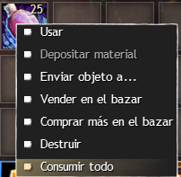
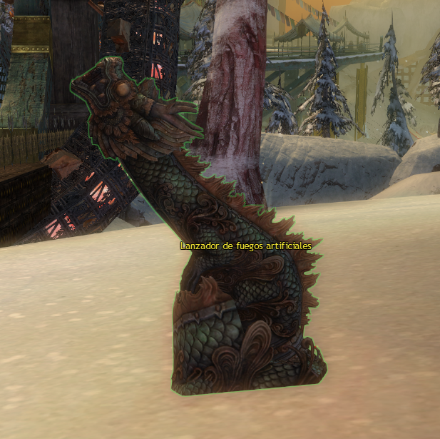
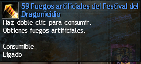
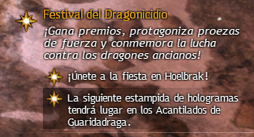
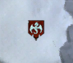
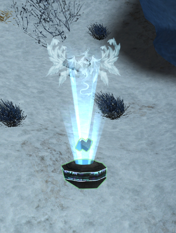
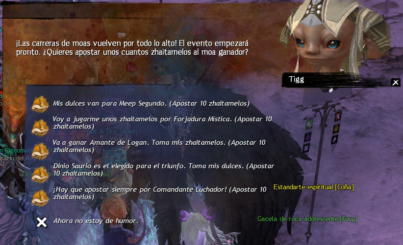
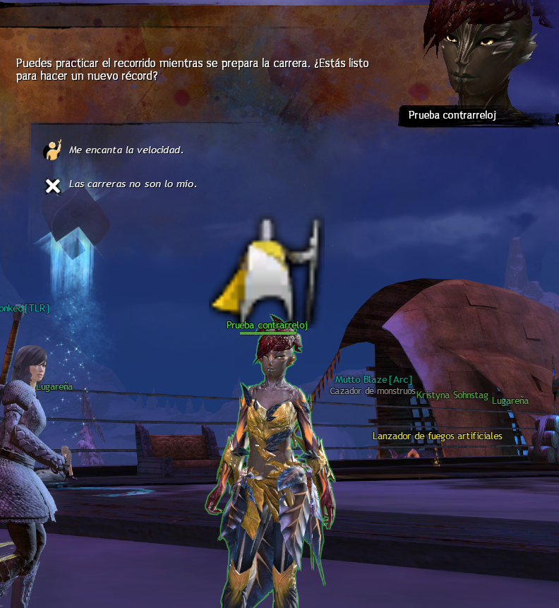
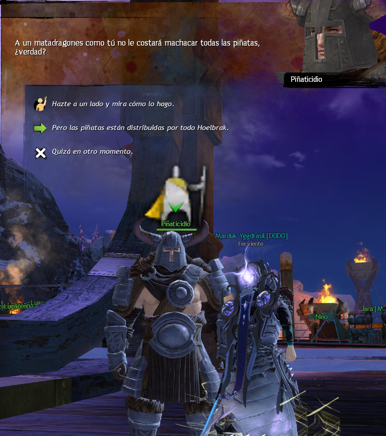

# Dragon Bash Daily Guide 

Esta guia contiene toda la informacion necesaria para la relizacion de las misiones diarias de la festividad, además de informacion complementaria sobre como realizar las aventuras diarias que se encuentran activas durante el evento.

## <a id=index>Diarias</a>

Esta festividad puede tener las siguientes diarias:

- [Anciamelos / Elder Taffy](#ElderTaffy)
- [Aplastador de siervos / Minion Masher](#MinionMasher)
- [Apunta al cielo / Aim for the Sky](#AimForTheSky)
- [Doma de hologramas / Holo Wrangler](#HoloWrangler)
- [Maestro de los moas / Moa Master](#MoaMaster)
- [Gladiador de la arena / Arena Gladiator](#ArenaGladiator)
- [Machacadragones / Dragon Slapper](#DragonSlapper)
- [Maestro de las monturas / Mount Master](#MountMaster)
- [Aplastador de papeles / Paper Smasher](#PaperSmasher)

### <a id="ElderTaffy">Anciamelos / Elder Taffy</a>

Consume 25 [zaitamelos](https://wiki.guildwars2.com/wiki/Piece_of_Zhaitaffy). Se pueden conseguir con el resto de diarias, al abrir los [cofres del dragón](https://wiki.guildwars2.com/wiki/Dragon_Coffer) o comprarlos en el leon negro.

[Volver al indice](#index)
### <a id="MinionMasher">Aplastador de siervos / Minion Masher</a>

Derrota a 30 enemigos del evento. Se puede realizar durante las diarias:
- [Doma de hologramas / Holo Wrangler](#HoloWrangler)
- [Arena Gladiator](#ArenaGladiator)

[Volver al indice](#index)
### <a id="AimForTheSky">Apunta al cielo / Aim for the Sky</a>

Lanza 10 fuegos artificiales, los lanzadores de fuegos artificiales se encuentran repartidos por Hoelbrak: 

Existen 2 rutas para realizar esta diaria.
- Empleado [Fuegos artificiales del festival del dragonicido](https://wiki.guildwars2.com/wiki/Dragon_Bash_Fireworks) (_Recomendada_):

Este item otorga un total de 9 cargas de fuegos artifiales dejando uno solo faltante.
- Sin emplear items adicionales. Activar 10 lanzadores de fuegos artificiales repartidos por Hoelbrak.

[Volver al indice](#index)
### <a id="HoloWrangler">Doma de hologramas / Holo Wrangler</a>

Realiza el evento [estampida de hologramas](https://wiki.guildwars2.com/wiki/Dragon_Bash_Hologram_Stampede!).

Este evento ocurre cada 15 minutos en los mapas colindantes con Hoelbrak. Rotando en el sentido de las agujas del reloj. 

- xx:00 - Colinas del Caminante [Este]
- xx:15 - Acantilados de Guaridadraga [Sur]
- xx:30 - Paso de Lornar [Oeste]
- xx:45 - Cúmulos de Guaridanieve [Norte]

Se puede acceder al siguiente mapa del evento mediante el indicador del evento en la parte superior derecha de la pantalla.

Haciendo click izquierdo sobre el indicador de "La siguiente estampida..." la camara te direccionara al punto de ruta correspondiente.

__Importante__! El indicador siempre marca la siguiente, por lo tanto, si le das a las xx:00 te marcara el que empieza a las xx:15 y tendras que esperar 15 minutos hasta que empiece en ese mapa, por lo tanto se recomienda viajar al mapa antes de la hora.

El evento consiste en combatir criaturas holograficas en las localizaciones marcadas.

El evento tiene 3 rondas, en cada ronda hay que activar y derrotar a los enemigos provenientes de marcador holografico en cada localizacion marcada en el mapa.

Se recomienda participar al menos en un marcador holografico por ronda para asegurar que cuente la participacion.

Este evento tiene un cap de 10 repeticiones diarias por cuenta. Y proporciona 6 [cofres del dragón](https://wiki.guildwars2.com/wiki/Dragon_Coffer) como recompensa.

[Volver al indice](#index)
### <a id="MoaMaster">Maestro de los moas / Moa Master</a>

Apuesta por el moa ganador, para realizar esta diaria a la primera haremos trampa y apostamos por todos los moas.
Para esta diaria requerimos 50 [zaitamelos](https://wiki.guildwars2.com/wiki/Piece_of_Zhaitaffy), ya que cada moa cuesta 10.

__Importate__! Para poder apostar se requiere tener el caramelo en el inventario, en caso de no tener suficiente no se mostrara ninguna opcion de que se posible apostar.

La diaria se realiza en [Punto de Ruta de Leyendas](https://wiki.guildwars2.com/wiki/Hall_of_Legends#Legends_Waypoint) [&BIwDAAA=], hablando con el Tigg [Apuestas de las carreras].

Apostaremos por 1 cada vez y volveremos a hablar con el npc hasta que se haya apostado por los 5 moas.

La fase de apuestas comienza 5 minutos despues de que acabe la carrera de moas.

[Volver al indice](#index)
### <a id="ArenaGladiator">Gladiador de la arena / Arena Gladiator</a>

Acceder a la [Arena del Dragon](https://wiki.guildwars2.com/wiki/Dragon_Arena) situada al oeste del [Punto de ruta de la Brújula del Héroe](https://wiki.guildwars2.com/wiki/Hero%27s_Compass#Hero.27s_Compass_Waypoint) [&BJADAAA=]. No confundirla con la mazmorra de supervivencia. La [Arena del Dragon](https://wiki.guildwars2.com/wiki/Dragon_Arena) es el modo facil.

La intancia consiste en 5 rondas las cuales se caracterizan por:
1. Ronda de enemigos holograficos que otorgan bonificacion de daño al matarlos.
2. Ronda de boss holografico. Este es el boss que se debe matar para obtener la diaria.

Una vez se completan las 5 rondas se reinician desde el principio.

[Volver al indice](#index)
### <a id="DragonSlapper">Machacadragones / Dragon Slapper</a>

Romper 15 piñatas repartidas por Hoelbrak.

Las piñatas de la aventura de romper piñatas no cuentan para este evento.

[Volver al indice](#index)
### <a id="MountMaster">Maestro de las monturas / Mount Master</a>

Realizar la aventura Carrera de monturas que empieza en [Punto de ruta Feria del Comercio](https://wiki.guildwars2.com/wiki/Trade_Commons#Trade_Commons_Waypoint) [&BIYDAAA=]

Para comenzar esta aventura hablar con el npc con el simbolo de aventura sobre la cabeza.

El objetivo de la diaria solo requiere completar la carrera, no requiere obtener medalla de oro, pero la medalla de oro otorga mas recompensas.

[Volver al indice](#index)
### <a id="PaperSmasher">Aplastador de papeles / Paper Smasher</a>

Realizar la aventura Piñaticidio en [Punto de ruta de Balcón Alto](https://wiki.guildwars2.com/wiki/Trade_Commons#Upper_Balcony_Waypoint)
[&BAgFAAA=]
Para compenzar esta aventura hablar con el npc con el simbolo de aventura sobre la cabeza.

La ruta recomendada por gw2 wiki es la siguiente.

Recomendaciones sobre esta aventura: 
- La habilidad 2 se resetea al activar la habilidad 3
- La habilidad 2 se puede activar en mitad del aire para un aterrizaje más preciso.
- La habilidad 3 se resetea al destruir una piñata.

[Volver al indice](#index)
